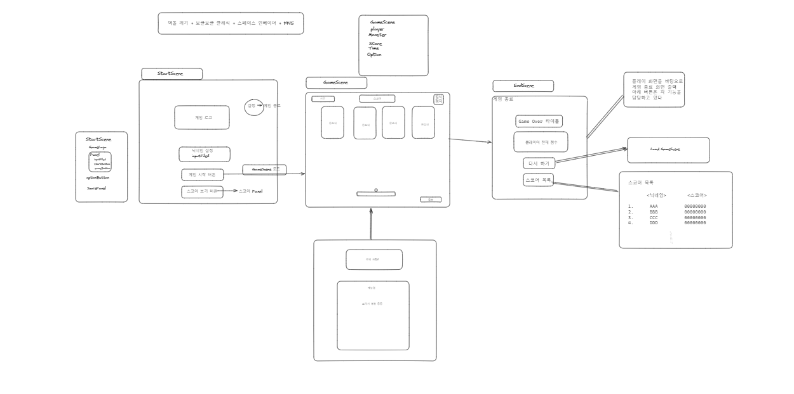
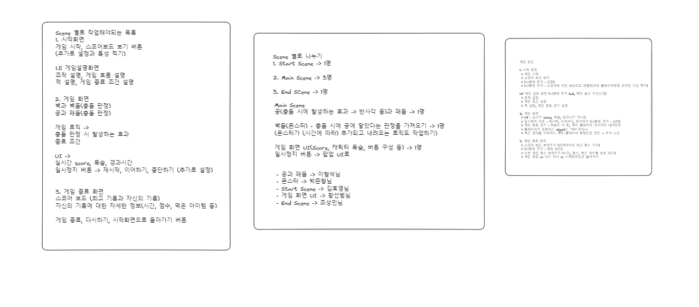

# CH15Project - 프로젝트 BIRD
 

 

## 팀원: 박준형(팀장), 김호영, 이형석, 조성민, 황선범

> Unity로 개발한 벽돌깨기 게임을 재해석한 게임입니다.  
> 최대한 OOP 와 SOLID원칙을 지키기 위해 노력했고, 이를 활용하기 위해 진행된 프로젝트입니다.  
> 5인 팀 프로젝트이며, 각자의 역할을 맡아 개발한 게임입니다.    
> 소통과 협업을 위주로 개발하였고, 개발 기간은 5일입니다.  
> 구현된 내용은 다음과 같습니다.

 

## 스토리 

어느날 5마리의 새가 나타나 소중한 알을 뺏아갔고, 이에 분노한 주인공 새가 알을 찾기 위해 훔쳐간 새들을
혼내주러 가는 이야기

## 주요 기능
* 배경 음악

* 인트로 (애니메이션 중요!)

* 게임 시작 화면
    * 게임 시작 버튼
    * 닉네임 및 캐릭터(볼) 선택 가능
    * 랭킹 시스템(스코어 보드)
    * 세팅에서 볼륨조절 및 원하는 볼 선택가능

* 게임 진행 화면
    * 몬스터 등장
    * 몬스터의 랜덤 배치
    * 각 몬스터별 특징 부여
    * 패들(둥지)과 볼(새)로 벽돌깨기 형식의 게임
    * 3개의 목숨으로 진행되며, 스코어와 현재 남은 시간 부여
    * 일시정지 가능 및 홈 다시 시작 기능 부여 

## 기능 세부 설명
* 게임 시작 전 인트로
    * 게임에 입장하면 인트로로 스토리라인을 설명한 후 게임 시작씬으로 넘어감

* 게임 시작 / 게임 시작 화면  
    * 게임 스타트 버튼 누를 시 메뉴얼 등장
    * 닉네임 설정 시 저장 및 이후 스코어에 등록될 시 이름과 점수가 함께 등록
    * 스코어보드 버튼 클릭시 현재 랭킹을 볼 수 있음
    * 좌측 상단에 세팅 누를 시 원하는 볼(새)를 선택할 수 있음
    * 배경 음악  
    
* 게임 진행 (메뉴얼)
    * 게임 스타트 버튼 누를 시 메뉴얼 등장
    * 키의 조작과 게임방식, 라이프 및 특수 적에 대한 설명이 나와있음

* 게임 진행
    * 패들과 볼로 게임을 시작
    * 일시정지 기능 및 다시하기, 홈으로가기 가능
    * 라이프는 3개로 우측 아래 알모양
    * 라이프 소모시 알이 깨지는 애니메이션과 함께 사라짐
    * 일반 새의 점수는 100점
    * 부엉이의 체력은 2이며 점수는 200점, 독수리는 십자형으로 터짐
    * 랜덤으로 나오는 새는 해당 새와 같은 새를 삭제해줌
    * 라이프가 모두 소모되거나, 몬스터가 패들보다 아래로 내려올 시 게임오버

* 게임 오버
    * 슬로우 모션을 취하며 Game Over! 문구를 보여주다 씬이 넘어감
    * 다시하기 및 메인으로 가기 버튼
    * 현재 스코어를 가져와서 스코어 보드에 등록됨

   

##  기술 스택

## 와이어 프레임

## 시연 영상

[프로젝트 시연영상] 

## 구현한 기능

### 게임 시작 화면

__인트로__

* 5마리의 새들이 알을 훔쳐가 화난 새가 이를 혼내주러 간다는 애니메이션

 __옵션__  

  

* 볼륨을 조절할 수 있음
* 볼(새)를 선택할 수 있음 

 

__스코어 보드__

 

* 랭킹이 확인 가능
* 1, 2, 3등의 알 모양을 다르게 해줌 

 

__이름 설정__

 

* 이름 설정 가능
* 이름 설정 시 이후 랭킹보드에서 확인 가능

 

### 게임 진행 메뉴얼

__메뉴얼__

 

* 게임 스타트 버튼 클릭시 메뉴얼 등장
* 조작키 가이드 및 게임 오버 조건 설명
* 각 몬스터들의 특징과 진행 방식 설명

 

### 게임 진행 화면

 

* 3개의 라이프로 시작
* 벽돌깨기와 같은 방식으로 진행
* 몬스터가 주기적으로 무한히 내려오는 형태
* 라이프가 전부 소진되거나, 몬스터가 패들 이하까지 소환될 시 게임오버

 

## 프로젝트 시 일어난 문제와 해결  

### 프로젝트

#### DontDestroyOnLoad 사용 이슈

__문제__:  

DontDestroyOnLoad 를 사용하여 씬을 넘길 시 필요한 정보들과 Manager 오브젝트들을 가져가기 위해 사용  
사용하는것에는 문제가 없었으나, 첫번째로는 내용을 넘기지 못하는 점과 팀원들 간의 씬 병합단계에서 받아오지 못하는 오류 발생  
거기에 심각한건 작동도 하는데 계속 NullReferenceException 오류 출력됨

__결과__:  

 싱글톤 사용도 해보았고, 모든 필요한 오브젝트에 DontDestroyOnLoad 도 적용했고, Awake 생명주기에서 처음 Instantiate 할 경우 이후에 씬을 Reload하는 단계에서는 작동하지 않아서 이를 대신해줄 Init함수로  해결을 해보려 했으나, 결국 값은 들어오는데도 NullReferenceException 오류가 떠 롤백하여 사용하지 않는 쪽으로 결정함. 내린 결론은 DontDestroyOnLoad 사용함에 있어 이해도 및 특이한 경우에 대처를 못하는 상황이 나와서 좀 더 공부하고 숙련이 되었을 때 다시 한번 사용해 보자는 결과에 도달함.

 

 #### 공과 패들 이슈

 __문제__:

공과 패들의 움직임과 충돌을 구현 후, 팀원 중 한 명이 게임 시작시 몬스터를 처리하고 싶은 위치로 이동해서 쏘는 형식이 어떻냐는 피드백을 받아서,
공이 스스로 움직이기 전, 패들과 같이 움직이도록 움직임을 조정하였다.
초기에는 같이 움직이는 기능이 구현이 되었지만, 문제는 공을 쏘고나서 패들과 충돌시에 공의 모양이 찌그러지는 문제가 발생하였다.
원인을 찾기 위해서, 공의 transform 값의 scale 값을 수정할 수 있는 스크립트와 컴포넌트들을 모두 검사하였지만, 아무도 직접적으로 영향을 주는 원인을 찾지 못하였지만 예상치 못한 곳에서 찾을 수 있었다.

 __결과__:

원인은 공 오브젝트를 패들의 자식 오브젝트로 선언한 것이 원인이였다. 이렇게 한 이유는 부모와 자식의 상속 관계를 이용해 이동 과정을 좀 더 쉽게 이끌어 내기 위해서 선언하였다.
여기서 근본적인 원인은 부모 오브젝트의 transform 값은 자식 오브젝트의 transform 값에도 영향을 미친다는 것이다. 실제로 공의 scale 값이 패들의 scale 값에 따라서 값이 배율처럼 조정되는 현상이 보였다.
한가지 말하자면 유니티는 2D 환경 프로젝트를 제공하지만, 실제로는 3D 공간에 2D 처럼 보이게 하도록 되어 있다. 결론적으로 3D 공간을 결정짓는 z 값이 2D 개발 환경에서 간섭적으로 존재한다고 볼 수 밖에 없다.
추가로 확인하기 위해서 공 오브젝트의 z 값 중 rotation 값을 조정을 해보았는데, 2D 공간에서 공이 회전하면서 찌그러지는 현상이 나타나였다.
결론적으로, 부모와 자식 관계에서는 transform 값 중 일부가 변경되기 때문에, 그 둘의 물리 충돌 발생시 간섭적으로 3D 환경을 구성하는 z 값이 변경되어 공이 찌그러지는 현상이 나온 것이다.
해결법은 간단하다. 공과 패들은 기능적으로 서로 독립적이기에 부모 자식 관계를 없애버리고, 공에 추가 bool 조건 값을 통해, 공이 쏘지 않는다는 false 값을 판단해서,
공의 이동 방법을 타겟이 되는 오브젝트의 transform의 position 값을 받아와서 이동하는 것으로 해결하였다.

  

 #### OOP 사용 및 SOLID 법칙 

  __문제__:

  __결과__:

 

### GitHub  

__문제__:  

__증상__:  

## 프로젝트 소감

___박준형___  

 
